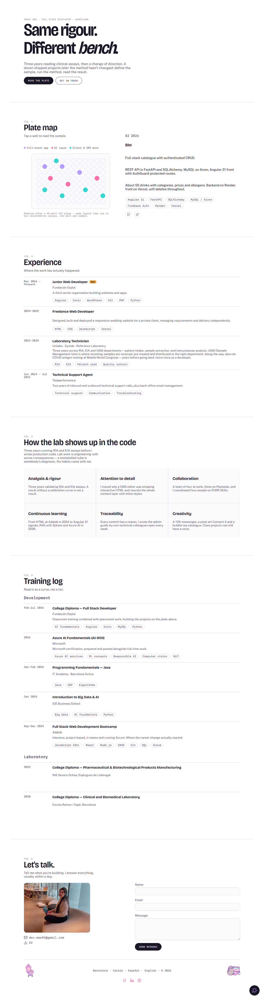

 

&nbsp;&nbsp;

 

  

 

&nbsp;

&nbsp;

 

---

##  &nbsp;Sobre el projecte

**Portfolio V2** és un lloc personal full-stack construït al voltant d'una sola idea: tres anys validant **assajos clínics RIA i EIA** en un laboratori, i després un canvi de carrera cap al desenvolupament de software — però el mètode no ha canviat. *Defineix la mostra, aplica el mètode, llegeix el resultat.*

Aquesta idea guia tota la interfície. Els projectes no es llisten: es **col·loquen en placa**. Una graella de 96 pous (`A1`–`H12`) amb l'aspecte d'una placa EIA real, on cada pou és un projecte lliurat i, en fer-hi clic, s'imprimeix la seva "lectura" (stack, enfocament, resultat). L'experiència està recolzada per **Bunsen**, un assistent de xat amb IA en streaming ("el secretari de Carme") que respon preguntes de les persones visitants sobre la seva feina fent servir un **pipeline RAG** real, basat en un corpus en primera persona — no una FAQ enllaunada.

Construït en solitari, de cap a cap: front en Angular 22, back en FastAPI, un protocol de xat per WebSocket fet des de zero, una capa de cerca vectorial a Qdrant Cloud, correu transaccional amb Resend, i i18n complet en **anglès, castellà i català** — sense cap llibreria d'i18n de tercers, un servei d'unes 30 línies en el seu lloc.

 

---

##  &nbsp;Stack tecnològic i arquitectura

| Capa | Tecnologia |
| :--- | :--- |
|  **Frontend** | Angular 22 (standalone, signals, preparat per a zoneless) · TypeScript · SCSS · Vitest |
|  **Backend** | FastAPI · Python 3.11 · Pydantic · Uvicorn |
|  **Capa d'IA** | Groq (`openai/gpt-oss-120b`) · chat completions en streaming sobre WebSockets |
|  **RAG / Base vectorial** | Qdrant Cloud (Cloud Inference) · embeddings `intfloat/multilingual-e5-small` |
|  **Correu transaccional** | Resend (lliurament del formulari de contacte) |
|  **Comunicació en temps real** | WebSockets natius (`/ws/secretari`), sense Socket.IO |
|  **Disponibilitat** | [`mee96/keep-alive`](https://github.com/mee96/keep-alive) — ping programat per evitar cold starts a Render |
|  **Desplegament** | Render (frontend + backend, tots dos com a web services) |

 

---

##  &nbsp;Vista prèvia

Vista completa del lloc en directe — hero, la graella de projectes de la Placa (projecte <code>B2</code>/BBT seleccionat), experiència, skills, training log i contacte.

 

---

##  &nbsp;Estructura del projecte

<pre><code>portfoli.v2/
├── 🐍 backend/
│   ├── app/
│   │   ├── main.py          → App FastAPI, CORS, registre de routers, /health
│   │   ├── contact.py       → POST /contact → enviament de correu amb Resend
│   │   ├── groq_client.py   → Chat completions en streaming via Groq
│   │   ├── rag/
│   │   │   ├── embeddings.py → Prefixos E5 query:/passage: (forat de Cloud Inference)
│   │   │   ├── index.py      → CLI: reindexar corpus/*.md a Qdrant
│   │   │   └── search.py     → Cerca per similitud, llindar de 0.70
│   │   └── ws/
│   │       └── secretari.py  → WS /ws/secretari — el bucle de conversa de Bunsen
│   ├── corpus/                → L'"expedient" de Carme, un tema per fitxer
│   │   ├── 01-profesional.md
│   │   ├── 02-laboratorio.md
│   │   ├── 03-proyectos.md
│   │   ├── 04-tecnico.md
│   │   └── 05-personal.md
│   ├── docs/                  → Prompts de sistema (frontend / backend / secretario)
│   ├── requirements.txt
│   └── .env.example
│
└── 🅰️ frontend/
    ├── public/
    │   ├── cv/                 → CV_Carme_Medina_{EN,ES,CA}.pdf
    │   └── foto.jpg, *.gif      → assets renderitzats a Contacte + footer
    └── src/app/
        ├── core/
        │   ├── data/            → Contingut estàtic: projectes, experiència, skills, formació
        │   ├── models/
        │   └── services/        → TranslationService, WebSocketService
        ├── features/
        │   ├── hero/
        │   ├── plate/            → Graella interactiva de 96 pous + lectura
        │   ├── experience/
        │   ├── skills/
        │   ├── training-log/
        │   ├── secretari/        → Widget de xat de Bunsen (FAB + panell)
        │   └── contact/          → Formulari, descàrrega de CV, xarxes
        └── shared/
            ├── i18n/              → en.json / es.json / ca.json
            └── ui/                → button, chip, header, lang-switcher, log-entry, section-header</code></pre>

 

---

##  &nbsp;Característiques clau

*  **La Placa:** els projectes es representen com a pous d'una placa EIA de 96 (`A1`–`H12`), acolorits segons el tipus (app full-stack / capa d'IA / feina per a client) i llegits amb un estat de selecció guiat per un `computed()` amb signals.
*  **Bunsen, el secretari d'IA:** un xat per WebSocket que emet les respostes de Groq token a token, basat en una cerca RAG sobre un corpus personal — amb una salvaguarda explícita al prompt de sistema perquè no repeteixi la seva "broma del cafè" més de dues vegades per conversa.
*  **RAG de debò, no una taula de cerca:** el corpus en markdown es trosseja per `## heading`, s'incrusta al servidor amb Qdrant Cloud Inference i es filtra amb un llindar de cosinus de 0.70 deliberadament laxa — una xarxa de seguretat per al "sense senyal", no un filtre de precisió (la responsabilitat de no inventar fets recau en el prompt de sistema, no en el cercador).
*  **UX honesta davant el cold start:** el pla gratuït de Render fa que el backend trigui uns segons a despertar-se — el widget de xat escala el seu propi missatge d'espera als 3s i 15s en lloc de mostrar un spinner mut.
*  **i18n fet a mà:** anglès, castellà i català amb un `TranslationService` d'unes 30 línies (cerca per clau amb notació de punts sobre diccionaris JSON) — sense `@angular/localize`, sense cap runtime d'i18n extern.
*  **Descàrrega de CV segons l'idioma:** l'enllaç del CV és un signal `computed()` que canvia el PDF (`CV_Carme_Medina_{EN|ES|CA}.pdf`) segons l'idioma actiu de la interfície.
*  **Formulari de contacte funcional:** Reactive Forms → FastAPI → Resend, amb reply-to configurat a l'adreça de la persona visitant.
*  **Amb tests unitaris:** 17 fitxers spec de Vitest que cobreixen components, serveis i integritat de dades, seguint les bones pràctiques d'Angular 22 (estat només amb signals, sense NgModules, `OnPush` per defecte, control de flux natiu).

 

---

##  &nbsp;Instal·lació i desenvolupament local

### Backend
<pre><code>cd backend
python -m venv venv
venv\Scripts\activate        # macOS/Linux: source venv/bin/activate
pip install -r requirements.txt
cp .env.example .env         # omple les credencials de sota
uvicorn app.main:app --reload</code></pre>

> Opcional: després d'editar qualsevol fitxer de `corpus/*.md`, reindexa Qdrant amb `python -m app.rag.index`.

> **Cold starts:** en producció el backend corre en el pla gratuït de Render, que atura el servei quan està inactiu. [`mee96/keep-alive`](https://github.com/mee96/keep-alive) és un petit job programat que fa ping a `/health` a intervals per mantenir-lo despert — apunta'l a la teva pròpia URL de `/health` desplegada si en fas un fork i el desplegues pel teu compte; no cal per al desenvolupament local.

### Frontend
<pre><code>cd frontend
npm install
ng serve</code></pre>

> Obre `http://localhost:4200` — l'entorn de desenvolupament apunta a `http://localhost:8000` per a l'API, així que arrenca el backend en paral·lel perquè funcionin el formulari de contacte i el xat de Bunsen.

### Tests
<pre><code>cd frontend
ng test</code></pre>

 

---

##  &nbsp;Variables d'entorn

Crea `backend/.env` (vegeu `backend/.env.example`):

| Variable | Propòsit | Obligatòria |
| :--- | :--- | :---: |
| `GROQ_API_KEY` | Clau de l'API de Groq per a les crides al LLM de Bunsen | ✅ |
| `QDRANT_URL` | URL del clúster de Qdrant Cloud | ✅ |
| `QDRANT_API_KEY` | Clau de l'API de Qdrant Cloud | ✅ |
| `QDRANT_COLLECTION` | Nom de la col·lecció amb els fragments del corpus indexats | ✅ |
| `FRONTEND_ORIGIN` | Origen CORS permès per al frontend desplegat | ✅ |
| `RESEND_API_KEY` | Clau de l'API de Resend per a l'enviament del formulari de contacte | ✅ |

El frontend no té variables d'entorn en temps d'execució — `apiUrl`/`wsUrl` s'intercanvien en temps de compilació entre `environment.ts` i `environment.prod.ts` mitjançant els `fileReplacements` d'Angular.

 

---

##  &nbsp;Desplegament i disponibilitat

Tots dos serveis estan desplegats a **Render**: el [lloc en directe](https://carme-portfoli.onrender.com/) i l'[API del backend](https://bunsen-backend.onrender.com/health). Actualment no hi ha cap pipeline de CI en aquest repositori (`.github/workflows/` és buit) — els tests s'executen en local amb `ng test`.

El pla gratuït de Render atura els serveis quan estan inactius. Un pinger de keep-alive dedicat (abans una GitHub Action dins d'aquest repo, ara un projecte propi — [`mee96/keep-alive`](https://github.com/mee96/keep-alive)) fa ping periòdicament al backend per reduir els cold starts; el widget de xat també degrada amb elegància mostrant missatges d'espera esglaonats quan sí que passa un cold start.

 

---

##  &nbsp;Limitacions conegudes

* **Sense persistència de l'historial de xat:** l'estat de la conversa de Bunsen viu a la memòria durant la vida d'una única connexió WebSocket — recarregar la pàgina comença una conversa nova.
* **Sense autenticació ni límit de peticions** a `/contact` ni a `/ws/secretari` — acceptable per a l'escala d'un lloc personal, no per a un producte públic.
* **Domini d'enviament compartit:** el formulari de contacte envia des de l'adreça de proves de Resend `onboarding@resend.dev`, a l'espera de verificar un domini propi.
* **Sense CI automatitzat:** el linting i els tests (`ng test`) s'executen només en local per ara, no a cada push/PR.
* **Sense fitxer `LICENSE`** encara al repositori.

 

---

 

<b>Construït en solitari, de cap a peus</b>

  

Desenvolupat per **Carme Medina Canalda**
*Full Stack Developer · Barcelona*

*"Mateix rigor. Un altre banc de feina."*

 

