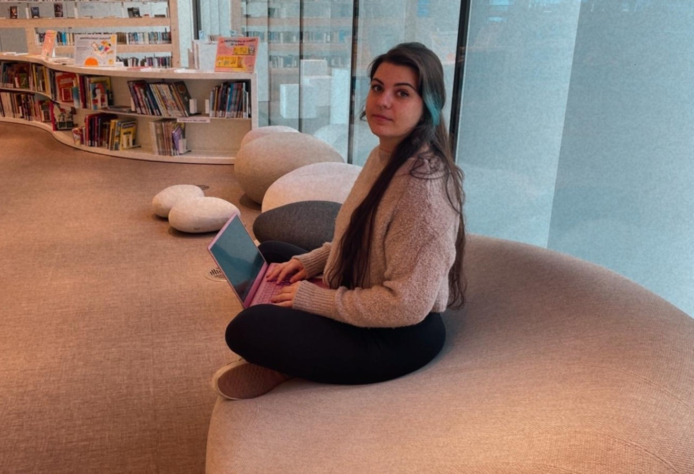
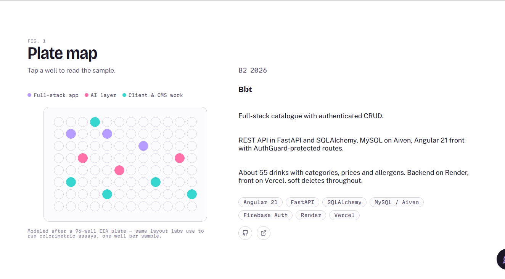
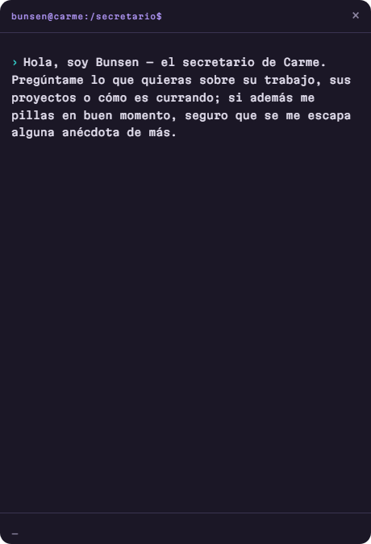
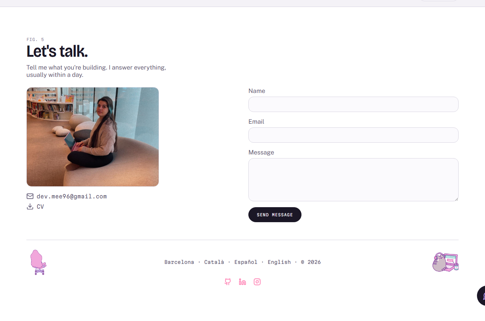

  
  
  

 

&nbsp;&nbsp;

&nbsp;&nbsp;

  

 

&nbsp;

&nbsp;

 

---

##  &nbsp;Vista previa

 <b>Fig. 1</b> — La Placa: proyecto <code>B2</code> (BBT) seleccionado, con su stack, descripción y enlaces.

  

 <b>Fig. 2</b> — Bunsen, el secretario de IA, respondiendo en streaming sobre un WebSocket en vivo.

  

 <b>Fig. 3</b> — Formulario de contacto, descarga de CV según idioma y enlaces sociales.

 

---

##  &nbsp;Sobre el proyecto

**Portfolio V2** es un sitio personal full-stack construido alrededor de una única idea: tres años validando **ensayos clínicos RIA y EIA** en un laboratorio, y luego un cambio de carrera hacia el desarrollo de software — pero el método no cambió. *Define la muestra, aplica el método, lee el resultado.*

Esa idea guía toda la interfaz. Los proyectos no se listan: se **colocan en placa**. Una rejilla de 96 pocillos (`A1`–`H12`) con el aspecto de una placa EIA real, donde cada pocillo es un proyecto entregado y al hacer clic se imprime su "lectura" (stack, enfoque, resultado). La experiencia está respaldada por **Bunsen**, un asistente de chat con IA en streaming ("el secretario de Carme") que responde preguntas de los visitantes sobre su trabajo usando un **pipeline RAG** real, apoyado en un corpus en primera persona — no una FAQ enlatada.

Construido en solitario, de extremo a extremo: front en Angular 22, back en FastAPI, un protocolo de chat por WebSocket hecho desde cero, una capa de búsqueda vectorial en Qdrant Cloud, correo transaccional con Resend, e i18n completo en **inglés, castellano y catalán** — sin librería de i18n de terceros, un servicio de ~30 líneas en su lugar.

 

---

##  &nbsp;Stack tecnológico y arquitectura

| Capa | Tecnología |
| :--- | :--- |
|  **Frontend** | Angular 22 (standalone, signals, listo para zoneless) · TypeScript · SCSS · Vitest |
|  **Backend** | FastAPI · Python 3.11 · Pydantic · Uvicorn |
|  **Capa de IA** | Groq (`openai/gpt-oss-120b`) · chat completions en streaming sobre WebSockets |
|  **RAG / Base vectorial** | Qdrant Cloud (Cloud Inference) · embeddings `intfloat/multilingual-e5-small` |
|  **Correo transaccional** | Resend (entrega del formulario de contacto) |
|  **Comunicación en tiempo real** | WebSockets nativos (`/ws/secretari`), sin Socket.IO |
|  **Deploy** | Render (frontend + backend, ambos como web services) |

 

---

##  &nbsp;Estructura del proyecto

<pre><code>portfoli.v2/
├── 🐍 backend/
│   ├── app/
│   │   ├── main.py          → App FastAPI, CORS, registro de routers, /health
│   │   ├── contact.py       → POST /contact → envío de correo con Resend
│   │   ├── groq_client.py   → Chat completions en streaming vía Groq
│   │   ├── rag/
│   │   │   ├── embeddings.py → Prefijos E5 query:/passage: (hueco de Cloud Inference)
│   │   │   ├── index.py      → CLI: reindexar corpus/*.md en Qdrant
│   │   │   └── search.py     → Búsqueda por similitud, umbral de 0.70
│   │   └── ws/
│   │       └── secretari.py  → WS /ws/secretari — el bucle de conversación de Bunsen
│   ├── corpus/                → El "expediente" de Carme, un tema por fichero
│   │   ├── 01-profesional.md
│   │   ├── 02-laboratorio.md
│   │   ├── 03-proyectos.md
│   │   ├── 04-tecnico.md
│   │   └── 05-personal.md
│   ├── docs/                  → Prompts de sistema (frontend / backend / secretario)
│   ├── requirements.txt
│   └── .env.example
│
└── 🅰️ frontend/
    ├── public/
    │   ├── cv/                 → CV_Carme_Medina_{EN,ES,CA}.pdf
    │   └── foto.jpg, *.gif      → assets renderizados en Contacto + footer
    └── src/app/
        ├── core/
        │   ├── data/            → Contenido estático: proyectos, experiencia, skills, formación
        │   ├── models/
        │   └── services/        → TranslationService, WebSocketService
        ├── features/
        │   ├── hero/
        │   ├── plate/            → Rejilla interactiva de 96 pocillos + lectura
        │   ├── experience/
        │   ├── skills/
        │   ├── training-log/
        │   ├── secretari/        → Widget de chat de Bunsen (FAB + panel)
        │   └── contact/          → Formulario, descarga de CV, redes
        └── shared/
            ├── i18n/              → en.json / es.json / ca.json
            └── ui/                → button, chip, header, lang-switcher, log-entry, section-header</code></pre>

 

---

##  &nbsp;Características clave

*  **La Placa:** los proyectos se representan como pocillos en una placa EIA de 96 (`A1`–`H12`), con color según el tipo (app full-stack / capa de IA / trabajo para cliente) y una selección leída con un `computed()` guiado por signals.
*  **Bunsen, el secretario de IA:** un chat por WebSocket que va emitiendo las respuestas de Groq token a token, apoyado en una búsqueda RAG sobre un corpus personal — con una salvaguarda explícita en el prompt de sistema para no repetir su "chiste del café" más de dos veces por conversación.
*  **RAG de verdad, no una tabla de búsqueda:** el corpus en markdown se trocea por `## heading`, se embebe en el servidor con Qdrant Cloud Inference y se filtra con un umbral de coseno de 0.70 deliberadamente laxo — una red de seguridad para el "sin señal", no un filtro de precisión (la responsabilidad de no inventar hechos recae en el prompt de sistema, no en el buscador).
*  **UX honesta ante el cold start:** el plan gratuito de Render hace que el backend tarde unos segundos en despertar — el widget de chat escala su propio mensaje de espera a los 3s y 15s en lugar de mostrar un spinner mudo.
*  **i18n hecho a mano:** inglés, castellano y catalán con un `TranslationService` de ~30 líneas (búsqueda por clave con notación de puntos sobre diccionarios JSON) — sin `@angular/localize`, sin runtime de i18n externo.
*  **Descarga de CV según idioma:** el enlace del CV es un signal `computed()` que cambia el PDF (`CV_Carme_Medina_{EN|ES|CA}.pdf`) según el idioma activo de la interfaz.
*  **Formulario de contacto funcional:** Reactive Forms → FastAPI → Resend, con reply-to configurado a la dirección del visitante.
*  **Con tests unitarios:** 17 ficheros spec de Vitest que cubren componentes, servicios e integridad de datos, siguiendo las buenas prácticas de Angular 22 (estado solo con signals, sin NgModules, `OnPush` por defecto, control de flujo nativo).

 

---

##  &nbsp;Instalación y desarrollo local

### Backend
<pre><code>cd backend
python -m venv venv
venv\Scripts\activate        # macOS/Linux: source venv/bin/activate
pip install -r requirements.txt
cp .env.example .env         # rellena las credenciales de abajo
uvicorn app.main:app --reload</code></pre>

> Opcional: tras editar cualquier fichero en `corpus/*.md`, reindexa Qdrant con `python -m app.rag.index`.

### Frontend
<pre><code>cd frontend
npm install
ng serve</code></pre>

> Abre `http://localhost:4200` — el entorno de desarrollo apunta a `http://localhost:8000` para la API, así que arranca el backend en paralelo para que funcionen el formulario de contacto y el chat de Bunsen.

### Tests
<pre><code>cd frontend
ng test</code></pre>

 

---

##  &nbsp;Variables de entorno

Crea `backend/.env` (ver `backend/.env.example`):

| Variable | Propósito | Obligatoria |
| :--- | :--- | :---: |
| `GROQ_API_KEY` | Clave de la API de Groq para las llamadas al LLM de Bunsen | ✅ |
| `QDRANT_URL` | URL del clúster de Qdrant Cloud | ✅ |
| `QDRANT_API_KEY` | Clave de la API de Qdrant Cloud | ✅ |
| `QDRANT_COLLECTION` | Nombre de la colección con los chunks del corpus indexados | ✅ |
| `FRONTEND_ORIGIN` | Origen CORS permitido para el frontend desplegado | ✅ |
| `RESEND_API_KEY` | Clave de la API de Resend para el envío del formulario de contacto | ✅ |

El frontend no tiene variables de entorno en tiempo de ejecución — `apiUrl`/`wsUrl` se intercambian en tiempo de compilación entre `environment.ts` y `environment.prod.ts` mediante `fileReplacements` de Angular.

 

---

##  &nbsp;Despliegue y disponibilidad

Ambos servicios están desplegados en **Render**: el [sitio en vivo](https://carme-portfoli.onrender.com/) y la [API del backend](https://bunsen-backend.onrender.com/health). Actualmente no hay ningún pipeline de CI en este repositorio (`.github/workflows/` está vacío) — los tests se ejecutan en local con `ng test`.

El plan gratuito de Render detiene los servicios cuando están inactivos. Un pinger de keep-alive dedicado (antes una GitHub Action dentro de este repo, ahora un proyecto propio — [`mee96/keep-alive`](https://github.com/mee96/keep-alive)) hace ping periódicamente al backend para reducir los cold starts; el widget de chat también degrada con elegancia mostrando mensajes de espera escalonados cuando sí ocurre un cold start.

 

---

##  &nbsp;Limitaciones conocidas

* **Sin persistencia del historial de chat:** el estado de la conversación de Bunsen vive en memoria durante la vida de una única conexión WebSocket — recargar la página empieza una conversación nueva.
* **Sin autenticación ni límite de peticiones** en `/contact` ni en `/ws/secretari` — aceptable para la escala de un sitio personal, no para un producto público.
* **Dominio de envío compartido:** el formulario de contacto envía desde la dirección de pruebas de Resend `onboarding@resend.dev`, a la espera de verificar un dominio propio.
* **Sin CI automatizado:** el linting y los tests (`ng test`) se ejecutan solo en local por ahora, no en cada push/PR.
* **Sin fichero `LICENSE`** todavía en el repositorio.

 

---

 

<b>Construido en solitario, de principio a fin</b>

  

Desarrollado por **Carme Medina Canalda**
*Full Stack Developer · Barcelona*

*"Mismo rigor. Otra mesa de trabajo."*

 

